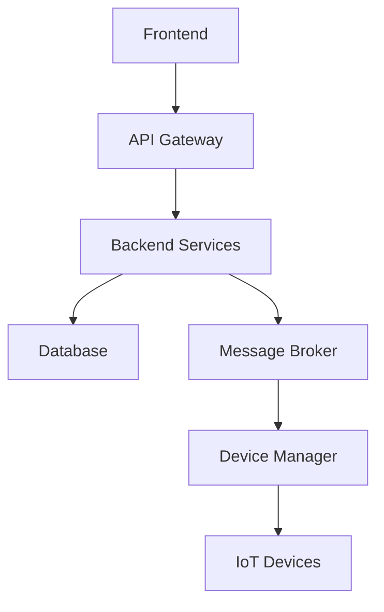

# System Patterns - KMA.SmartHome

## Kiến trúc tổng thể

## Các thành phần chính

### Frontend
- Sử dụng React.js với TypeScript
- Kiến trúc component-based
- State management với Redux
- Responsive design

### Backend
- Clean Architecture với .NET Core
- CQRS Pattern
- Repository Pattern
- Mediator Pattern
- SignalR cho real-time communication
- Authentication & Authorization với JWT

### Database
- MongoDB cho dữ liệu chính
- Redis cho caching
- Time-series database cho metrics

### Message Broker
- MQTT cho IoT communication
- Kafka cho event streaming
- RabbitMQ cho service communication

## Design Patterns

### Frontend
- Container/Presenter pattern
- HOC (Higher Order Components)
- Custom hooks
- Context API

### Backend
- Repository pattern
- Unit of Work pattern
- Factory pattern
- Strategy pattern
- Mediator pattern
- Observer pattern

### IoT
- Command pattern
- State pattern
- Adapter pattern
- Bridge pattern

## Security Patterns
- JWT authentication
- Role-based access control
- API key management
- Device authentication
- Data encryption

## Deployment
- Docker containers
- Kubernetes orchestration
- CI/CD pipeline
- Monitoring & logging

## Testing Strategy
- Unit testing với xUnit
- Integration testing
- E2E testing
- IoT device testing 